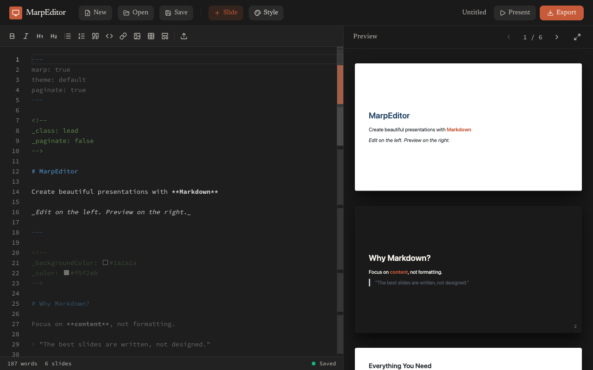
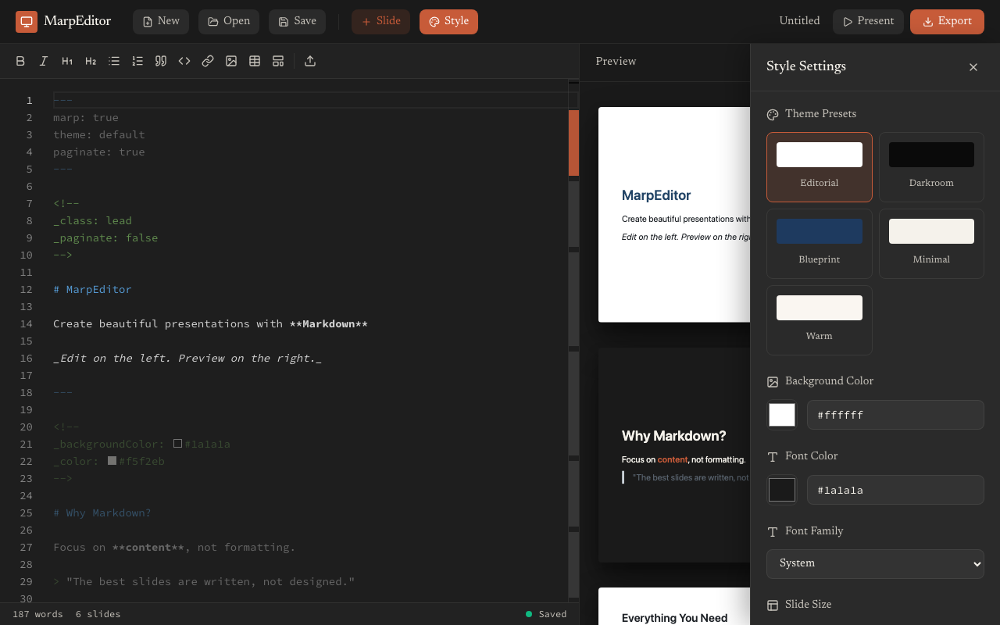
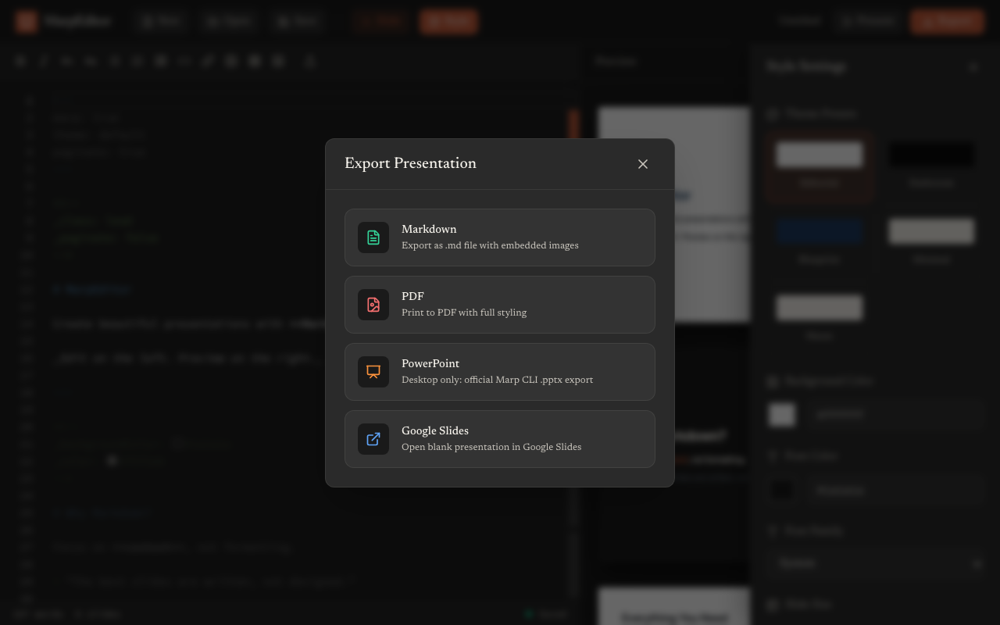
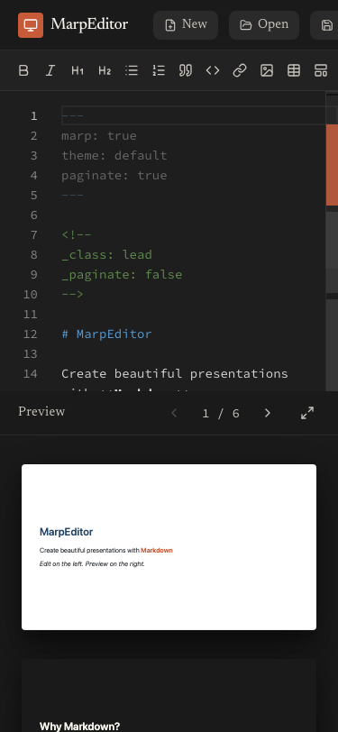

# MarpEditor

MarpEditor is a single-page editor for building Marp presentations in Markdown. It combines a Monaco editor, a live Marp preview, local file handling, image storage, browser PDF printing, and a Tauri desktop shell for release builds.



## Features

- Monaco Markdown editor with formatting actions, image paste, upload, and drag/drop.
- Live preview rendered by `@marp-team/marp-core`.
- Slide navigator, presentation mode, and preview navigation using one shared slide parser.
- Local-first persistence with the File System Access API where available and IndexedDB for images.
- Export to Markdown, PDF through browser print, and desktop PPTX through the official Marp CLI.
- Installable PWA for browsers and Tauri v2 builds for desktop releases.

### Style Settings

Customize themes, colors, fonts, slide sizes, and logos.



### Export

Export to Markdown, PDF, PowerPoint (desktop), or Google Slides.



### Mobile

Works on mobile devices with a responsive stacked layout.



## Marp Compatibility

Preview, presentation mode, and PDF output use Marp Core. PPTX output uses the official Marp CLI:

```bash
marp input.md --pptx -o output.pptx
```

The default PPTX export is high-fidelity visual output. It is not intended to be fully editable in PowerPoint. Marp CLI's `--pptx-editable` mode is intentionally not enabled by default because it is experimental, requires LibreOffice, and can reduce visual fidelity.

## Requirements

- Node.js 18 or newer.
- npm.
- Rust and platform-specific Tauri dependencies for desktop builds.
- Marp CLI for PPTX conversion in desktop mode.
- Chrome, Edge, or Firefox available to Marp CLI for PPTX, PDF, and image conversion.

## Development

```bash
npm install
npm run dev
```

Useful commands:

```bash
npm run lint
npm run build
npm run preview
npm run desktop:dev
npm run desktop:build
npx marp --version
```

## Export Matrix

| Format | Environment | Implementation |
| --- | --- | --- |
| Markdown | Browser and desktop | Saves Markdown with embedded images |
| PDF | Browser and desktop | Marp Core HTML printed by the browser |
| PPTX | Desktop | Tauri command invoking official Marp CLI |
| Google Slides | Browser and desktop | Opens a blank Google Slides deck |

In the browser/PWA, PPTX export shows a desktop-only message. Export Markdown and run Marp CLI manually when using the web app.

## Desktop Builds

The desktop app is configured with Tauri v2 in `src-tauri/`.

- Product name: `MarpEditor`
- Identifier: `com.marpeditor.desktop`
- Frontend build output: `dist`
- Dev URL: `http://localhost:5173`

The desktop PPTX command writes the current Markdown to a temporary file, runs Marp CLI with `--pptx`, returns the generated `.pptx`, and removes temporary files.

## Install

### macOS (Homebrew)

```bash
brew tap twojanazwa/marpeditor
brew install --cask marpeditor
```

> If Gatekeeper blocks the app on first launch, run:  
> `xattr -dr com.apple.quarantine /Applications/MarpEditor.app`

### Windows (Scoop)

```bash
scoop bucket add marpeditor https://github.com/twojanazwa/scoop-marpeditor
scoop install marpeditor
```

### Browser / PWA

Open the deployed URL in a modern browser and install via the address bar (Chrome/Edge) or Share → Add to Home Screen (Safari).

---

## Releases

GitHub Actions builds release artifacts from tags matching `v*` across Linux, Windows, and macOS universal targets. The workflow creates a draft release with desktop assets.

Package manager manifests (Scoop and Homebrew) are updated automatically when a release is published.

### One-time setup for package manager auto-updates

Run this from the repo root (requires [GitHub CLI](https://cli.github.com/)):

```bash
./scripts/setup-package-repos.sh
```

It creates the required `scoop-marpeditor` and `homebrew-marpeditor` repositories and configures the `TAP_PUSH_TOKEN` secret so CI can push manifest updates.

## Security Notes

Marp rendering allows Markdown HTML for compatibility. Preview output is rendered in a sandboxed iframe, but presentations should still be treated as local user content. Files and images are stored locally in the browser or desktop app; there is no backend, authentication layer, or encrypted storage.
